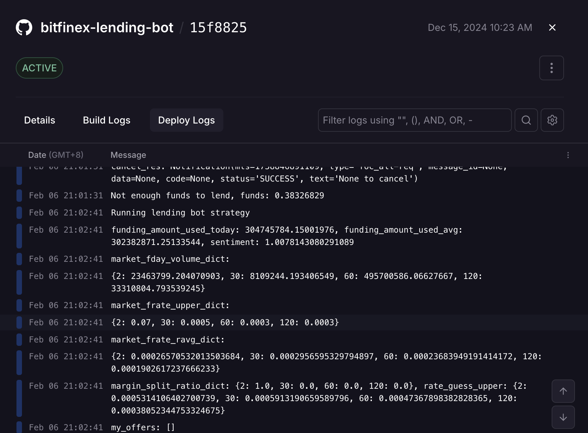

# Bitfinex Lending Bot

An automated lending bot for Bitfinex that optimizes lending rates and manages fund allocation through a dynamic grid strategy.

## Features

- 🔄 Automatic market rate detection
- 📊 Dynamic grid-based offer placement
- ⚡ Real-time rate adjustment (every minute)
- 📈 Split orders for risk diversification
- 🤖 Fully automated operation

## How It Works

The bot continuously monitors the Bitfinex funding market and:
1. Fetches current market rates to determine optimal lending opportunities
2. Splits your available funds into multiple offers using a grid strategy
3. Places offers at competitive rates across different price points
4. Automatically adjusts offers every minute based on market conditions
5. Maximizes returns while maintaining competitive rates

## Example Usage

## Setup

deploy on railway or any other app platform supports docker

## Configuration

Add BF_API_KEY and BF_API_SECRET in the environment setup section

## Requirements

python 3.10
run the pip install -r requirements.txt 

## Disclaimer

This bot is for educational purposes only. Use at your own risk. Cryptocurrency lending carries inherent risks, and past performance does not guarantee future results.

## License

Free to use and modify
